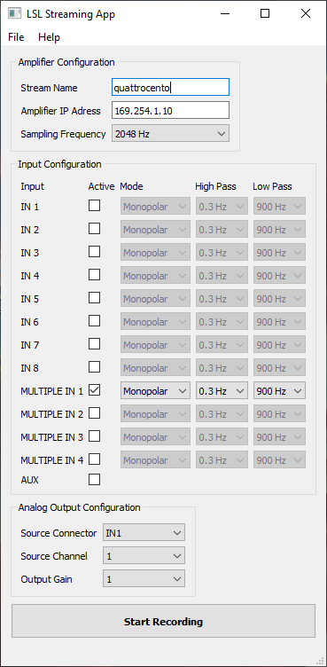

# Quattrocento LSL App

**Quattrocento LSL App** connects to an **OTB Quattrocento amplifier** and streams the data to the network as a **[Lab Streaming Layer (LSL) stream](https://labstreaminglayer.org)**.

# Requirements

Quattrocento LSL App requires Windows 10 or newer.

# Installation

There is no special installation step required. Download _QuattrocentoLSLApp.zip_ from [GitHub](https://github.com/neurofreiburg/QuattrocentoLSLApp/releases), unpack it, and run Quattrocento LSL App.

# Usage

**Amplifier Configuration:**

The application allows you to specify the LSL stream name, the amplifier IP address and the sampling frequency. Usually, you do not need to change the LSL stream name or the IP address of the amplifier.

**Input Configuration:**

You can select the amplifier input ports (_IN 1-8_, _MULTIPLE IN 1-4_, _AUX_), recording mode (_monopolar_ or _differential_), and filter settings.

**Analog Output Configuration:**

You can select the input channels to be forwarded to the amplifier's analog output port.

**Saving/Loading a Configuration:**

Quattrocento LSL App allows you to load/save your configuration (_File_ -> _Load/Save Configuration_). You can also load a configuration file at program start by passing the file name as a command line parameter:

`QuattrocentoLSLApp.exe conf.cfg`

# Building the Quattrocento LSL App

Quattrocento LSL App is based on the [C++ app template](https://github.com/labstreaminglayer/AppTemplate_cpp_qt) from the LSL project. You can find the build instructions [here](https://labstreaminglayer.readthedocs.io/dev/app_build.html).

# License

Quattrocento LSL App is released under the [GPLv3 license](LICENSE).

This software uses the following components:

Qt, [LGPL license](https://doc.qt.io/qt-5/lgpl.html)

Boost, [Boost software license](https://www.boost.org/users/license.html)

liblsl, [MIT license](https://github.com/labstreaminglayer/liblsl/blob/master/LICENSE)

LSL App Template CPP Qt, [MIT license](https://github.com/labstreaminglayer/AppTemplate_cpp_qt/blob/master/LICENSE.txt)

# Citing QuattrocentoLSLApp

If you use Quattrocento LSL App in your experiments, please cite the GitHub repository <https://github.com/neurofreiburg/QuattrocentoLSLApp>.

# Contact

To contact the developers, get in contact with Patrick Ofner <patrick@ofner.science>, [Bernstein Center Freiburg](https://www.bcf.uni-freiburg.de) @ University of Freiburg.

# Acknowledgements

Quattrocento LSL App was supported by the EU FET Open project [NIMA](https://nima-project.eu).
